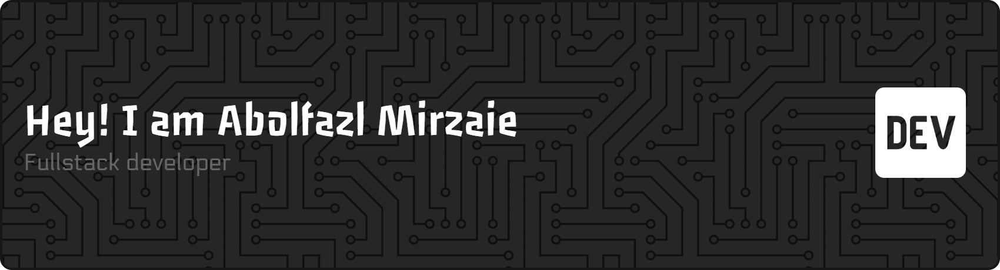

# Hi, I'm Abolfazl Mirzaei 👋

### Software Developer | Engineering Student | Problem Solver
I'm Abolfazl Mirzaei, an engineering student interested in software development, technology, and building practical solutions.

I enjoy learning new technologies, working on real-world projects, and turning ideas into clean and useful software.
## 🚀 What I'm Working On

* 🔭 Building and improving personal software projects
* 🌱 Continuously learning and improving my development skills
* 🧩 Exploring new technologies and practical problem-solving
* 📚 Strengthening my knowledge of software engineering and computer systems
## 🛠️ Skills & Tech Stack

### 💻 Programming Languages

`C` · `C++` · `Python` · `JavaScript`

### 🌐 Web Development

`HTML` · `CSS` · `Frontend` · `Backend`

### 🗄️ Databases

`Database Development` · `SQL`

### 🔧 Tools & Environment

`Git` · `GitHub` · `Linux` · `VS Code`

### 🧠 Areas of Interest

`Software Development` · `Backend Development` · `Frontend Development` · `Database Systems` · `Web Development`

### ✨ Development Style

`Problem Solving` · `Clean Code` · `Continuous Learning` · `Vibe Coding`

<h3 align="left">Languages and Tools:</h3>

  

  

  

  

  

## 📌 Featured Projects

### 🔹 Coming soon!
## 🤝 Connect With Me

* 💻 GitHub: dev-xorpet
* 📧 Email: xorpet@gmail.com

